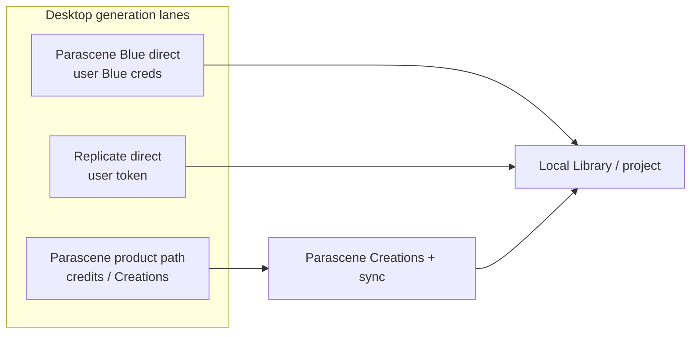
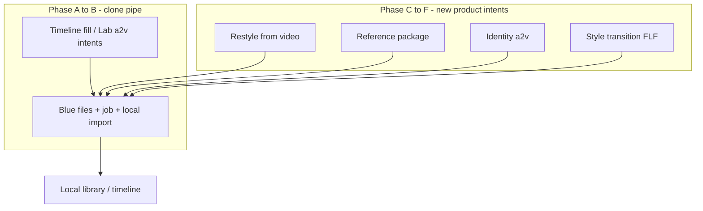

# Plan — Direct integration with Parascene Blue

Prove **Parascene Blue** as a first-class desktop generation lane: talk to `https://blue.parascene.com` with user credentials, upload inputs to Blue, run generation, and land outputs in the **local** library — without www create UI, Parascene-hosted intermediates, or Creation rows.

**Capabilities snapshot:** [parascene-blue-api-capabilities.json](./parascene-blue-api-capabilities.json).

**Status:** Lab proof lane is **shipped**. Generate is **intent-first** (modality recipe → server). **Direct to Blue** is a Generate server under wired intents (T2V / I2V / Image+Audio→Video / T2I) with **local-only** outputs. Parascene Creation path remains the credits server. Video to Video / Reference to Video / Image to Image show in the catalog as Coming soon until substrate (Phases C–F).

## Why (short)

- Desktop is where bleeding-edge Blue lands; web stays social / credits / softer.
- Blue already exposes `/api/files` uploads and advanced video (`video2video`, `reference2video`, newer models) that web does not fully surface — skip the middleman instead of pushing web forward.
- Keep Parascene product storage/DB from accumulating desktop scratch media.

## Lanes (do not conflate)



| Lane | UI label | Today | Target |
| --- | --- | --- | --- |
| Product | **Parascene** | OAuth → `sdk.create` `server_id: 6` → Creation → ingest | Stay credits-first; label must say Parascene, not Blue |
| Blue direct | **Direct to Blue** | Settings creds → Lab methods + Generate server (local-only) | Phases C–F: v2v / r2v substrate |
| Replicate | **Replicate** | Settings token + Lab / Editor local import | Peer pattern for Blue-direct gating |

Stable code ids (e.g. `parascene_blue` on the product path) may stay legacy until renamed; **user-facing copy** must not call the Creation path “Blue.”

## What we know (Blue server)

- **Base:** `https://blue.parascene.com`
- **Capabilities:** `GET /api` — status, methods, field schemas, capability matrix, retention TTLs
- **Methods (snapshot):** `text2image`, `image2image`, `text2video`, `image2video`, `audio2video`, `video2video`, `reference2video` — async, model/option fields
- **Inputs:** https URL, small data URI (images/audio; not video), or **`/api/files/…` upload refs** (Blue-native hosting; short TTL)
- **Auth:** Bearer token; Cloudflare Access client id/secret headers (Settings keychain JSON). Optional process-env fallback when Settings is empty.
- **Optional `.env`:** `PARASCENE_BLUE_TOKEN`, `PARASCENE_BLUE_CF_ACCESS_CLIENT_ID`, `PARASCENE_BLUE_CF_ACCESS_CLIENT_SECRET` (and example in `.env.example`) — useful for agents and probes; app prefers Settings-stored user creds

Refresh the capabilities JSON when the server contract changes.

## Success criteria (“proved”)

A user can:

1. Save Blue credentials in **Settings**
2. Run **one** Blue-direct generation from desktop
3. Get a media file in the **local project library**
4. With **no** new Parascene Creation and **no** web UI work

## Proof phases

### 1. Naming / catalog

- [x] Keep the product-path provider labeled **Parascene** (credits / Creations).
- [x] Introduce a distinct **Parascene Blue** Lab lane for direct-only methods (not `server_id: 6`).
- [x] Do not silently route “Blue” UI to `server_id: 6`.
- [ ] Broader catalog / badge rename of legacy code ids if still needed outside Lab.

### 2. Credentials (mirror Replicate)

Pattern reference: Replicate block in [`src/settings/SettingsModal.tsx`](../src/settings/SettingsModal.tsx) + keychain commands (`replicate_token_status` / `set` / `clear`).

**Shipped in Settings:**

- [x] API token (Bearer)
- [x] CF Access client id + secret
- [x] Base URL hardcoded to `https://blue.parascene.com` (not a Settings field)
- [x] Secure storage (system keychain) + status / preview / replace / clear
- [x] Gate Lab Parascene Blue surfaces until configured (CTA to Settings)
- [x] Optional `PARASCENE_BLUE_*` env fallback when Settings is empty
- [x] Do not fall back to the Parascene product path when Blue creds are missing

### 3. Thin client

Minimum Blue HTTP surface for the Lab proof:

| Step | Purpose | Status |
| --- | --- | --- |
| `GET /api` | Capabilities / health | [x] Lab methods catalog |
| Upload to `/api/files` | Inputs without Parascene hosting | [x] |
| Submit async method | Generate per Blue contract | [x] |
| Poll / status | Job completion | [x] |
| Download output | Fetch result URL(s) | [x] |
| Local import | Library import — Replicate-style | [x] Lab Save to Library |

**Ownership:** Rust-owned Blue I/O and wait ([PLAN-backend-ownership.md](./PLAN-backend-ownership.md)); React owns Lab intent UI and status display.

**Provenance:** Blue Lab jobs use local run folders under Cache/blue (distinct from Creation-backed Parascene jobs and Replicate).

### 4. First proof surface

- [x] Wire proof into Lab: **Parascene Blue methods** + unified **Predictions** (Replicate + Blue history)
- [x] Capabilities-driven run form, local file / Library picks, delete (incl. batch)
- [ ] Manual proof against live Blue; refresh capabilities snapshot if contract drifted
- [x] Productizing `video2video` / `reference2video` UI — Generate on Parascene + Direct to Blue (see [PLAN-v2v-ref2v.md](./PLAN-v2v-ref2v.md))

### 5. Client growth required (proof)

| Area | Growth for proof | Status | Later |
| --- | --- | --- | --- |
| Provider catalog | Split Parascene vs Parascene Blue labels/lanes | [x] Lab | Rename legacy ids if needed |
| Settings | Blue creds UI + storage + status events | [x] | Cookie rotation helpers |
| Blue HTTP client | Upload + create + poll + download | [x] | Broader Editor mapping |
| Jobs / status | Lab local history + wait | [x] Lab | Editor add-asset resume [x] |
| Library | Local import without Creation id | [x] Lab | Optional promote-to-Creation |
| Generate UI | Lab methods gated + form | [x] Lab | Timeline fill / intent Generate [x] |

## Parity clone vs product growth

Two different jobs. **Do not conflate them.**

1. **Parity clone** — same desktop intents that already work on the Parascene product path; swap the pipe to Blue-direct.
2. **Product growth** — new desktop intents and substrate so makers can use what Blue already exposes (especially video-in and multi-ref) without waiting on web.



### What Blue-through-Parascene already supports

Today’s product path is mostly one composed workflow — **timeline fill** — plus Lab create / a2v / MV Build. Continuity + audio map onto three Blue methods via `sdk.create` `server_id: 6` → Creation → ingest.

| Product intent | Blue method | Models used today | Inputs staged via Parascene |
| --- | --- | --- | --- |
| Images: None | `text2video` | `wan_t2v`, `ltx_t2v` | prompt, duration, aspect |
| Start frame | `image2video` | `wan_i2v`, `ltx_i2v` | 1 still → Parascene upload URL |
| First + last | `image2video` | `wan_i2v` | 2 stills → Parascene URLs |
| Start + audio | `audio2video` | `ltx_a2v` | still URL + `audio_clip_id` |

**Key files (product path):** [`AddAssetGeneratePanel.tsx`](../src/layouts/editor/AddAssetGeneratePanel.tsx), [`addAssetGenerate.ts`](../src/layouts/editor/addAssetGenerate.ts), [`previewIntent.ts`](../src/layouts/editor/previewIntent.ts), runners under [`src/lab/`](../src/lab/) (`blueT2vGeneration.ts`, `flf2vGeneration.ts`, `ltxI2vGeneration.ts`, `a2vGeneration.ts`), [`ingestCreation.ts`](../src/lab/ingestCreation.ts).

**Not used on this path historically:** Blue `/api/files`, `prompt_magic`, MiniMax family, `video2video`, `reference2video`. **Direct to Blue Generate** now uses `/api/files` + local import for wired intents; style-transition FLF models are available where selected.

Product mental model today: **blank clip → continuity + optional song audio → one video out.** That is what parity clone reuses.

### Phase A–B — Clone for Blue-direct (same product, new pipe)

Almost no UX redesign for those intents. Swap the middle:

```text
TODAY:  local still/audio → Parascene host → create(server 6) → Creation → ingest
DIRECT: local still/audio → Blue /api/files → Blue job → download → local import
```

| Reuse as-is | Must change |
| --- | --- |
| Add Asset form (prompt / WAN\|LTX / Images / Source audio / duration / framing) | Settings Blue creds + gate |
| Lab a2v / i2v shapes | Upload target → Blue `/api/files` |
| Timeline placeholder + resume UX | Submit / poll client (no Creation) |
| Badge field shape | Provider / server label (**Parascene** vs **Direct to Blue**); Blue job id instead of Creation id |

- **A.** [x] Creds + thin client + Lab methods/Predictions → pipe proved in Lab.
- **B.** [x] Generate intent-first IA + Direct to Blue adapter for timeline video intents (and T2I) → local-only; Parascene Creation path unchanged.

**Editor Generate notes (shipped with B):** independent first/last frame sources (timeline neighbor / Assets / none), Result | Form dual view, Generate new with durable frame stamps, style-transition-capable FLF models on Direct to Blue where the method allows.

### Gap that parity does not close

| Blue has now | Desktop product today | What must grow |
| --- | --- | --- |
| `/api/files` for video / audio / image | Only Parascene hosting | Local → Blue upload as default for direct lane |
| Extra models on known methods (`minimax_*`, `ltx_style_transition`, `ltx_id_lora`, …) | Hardcoded WAN \| LTX toggles | Method-aware model picker (live `GET /api` or snapshot), not a 2-button enum |
| `prompt_magic`, longer windows, `start_offset_seconds` | Hidden / ignored | Expose where the method needs them |
| **`video2video`** | Nothing | New intent: driving / control video + optional character still |
| **`reference2video`** | Nothing | New intent: reference package (N images / videos / audios + tagged prompt) |
| Blue `text2image` / `image2image` | Lab stills via Replicate / server 1 | Optional Blue stills lane (product choice; Replicate may stay default for stills) |

Cloning timeline fill does **not** unlock v2v / r2v. Those need new **jobs the UI knows how to ask for**.

### Phase C–F — Modify the product for Blue’s new surface

Product form concept for attaching typed refs (and sequencing C→E in maker language): [PLAN-refs-to-video.md](./PLAN-refs-to-video.md).

Do **not** bolt every Blue field onto “Images: None | Start | First+last.” That ontology is still-continuity. Grow by **intent**, Blue-direct-first, mapped to Blue methods:

| New / extended intent | Blue method / models | Notes |
| --- | --- | --- |
| Restyle / control from video | `video2video` (`ltx_ic_lora`, `wan_animate`, `bernini_r_v2v`, `wan_scail*`) | Pick timeline clip or library video + optional ref still |
| Generate from references | `reference2video` (`minimax_r2v`, `ltx_ingredients`) | Reference tray; tagged prompt (`<Picture 1>`, …) |
| Identity talk | `audio2video` + `ltx_id_lora` | Extends a2v (start face required); does not replace `ltx_a2v` |
| Style morph | `image2video` + `ltx_style_transition` / `ks_style_transition` | **Partial:** first/last + style models on Generate; deepen via Phase F |

**Shared substrate** (real product investment; unlocks C–F):

- **Media ref picker** — project stills, timeline clips, library videos / audio → Blue file refs
- **Source window** — in/out or `start_offset_seconds` + duration (needed for v2v)
- **Capabilities-aware form** — field schema from Blue (or checked-in snapshot), not a one-off WAN/LTX panel
- **Local-only provenance** — job id, method, model, input refs; no Creation id

Sequencing:

| Step | Outcome |
| --- | --- |
| **C.** Media ref picker + video upload to Blue | Unlocks everything below |
| **D.** One v2v model (e.g. `wan_animate` or `ltx_ic_lora`) | First “Blue can, web can’t” desktop feature |
| **E.** Reference package / MiniMax r2v | Multimodal maker workflow |
| **F.** Enrich existing methods (`prompt_magic`, MiniMax i2v/t2v, style transition, id-lora) | Depth on familiar surfaces |

### Explicitly do not

- Mirror web Advanced Create on desktop — web is behind Blue; desktop follows **Blue’s contract**, not www’s subset.
- Stuff v2v / r2v into timeline-fill continuity modes — wrong ontology.
- Wait for Parascene Creations / share hosting to grow `video_url_array` — that is the middleman Blue-direct skips.
- Ship full v2v / r2v as the first milestone — prove the pipe (A), then parity (B), then substrate (C).

## Open items

- Long-term auth: service token vs user session vs OAuth vs CF Access bag
- Whether/when local Blue gens can **promote** to Parascene Creations
- Credits UI coexistence (product lane) vs Blue-direct (no web credits)
- Retention: Blue input/output TTLs vs always archiving locally on success
- Refresh process for CF cookies if they remain in the auth story

## Out of scope (first implementation PR)

- Changing the web/parascene create UI for parity
- Shipping v2v / r2v / reference-package UI before phases A–B
- Replacing the Parascene credits product path (it stays for web migrants)

## Implementation checklist

1. [x] Settings: Blue creds set / status / clear + gate event (mirror Replicate; hardcoded base URL)
2. [x] Rust thin Blue client: auth headers, files upload, job submit/poll, download
3. [x] Lab: Parascene Blue methods + unified Predictions (capabilities form + local history; creds gate; delete / batch delete)
4. [x] Local import + provenance for Blue-direct Lab output
5. [x] Manual proof against live Blue; refresh capabilities snapshot if contract drifted — still recommended when contracting drifts
6. [x] Phase B: Generate intent-first + Direct to Blue on core video/T2I intents (local-only)
7. [ ] Phases C–F: media ref picker, then v2v / r2v / enrichments (see above)
8. [x] Doc status: Generate intent-first + Direct to Blue server; growth items remain backlog

**Lab notes:** Base URL is hardcoded to `https://blue.parascene.com`. Credentials live in Settings (keychain JSON: `token`, `cfAccessClientId`, `cfAccessClientSecret`) with optional `PARASCENE_BLUE_*` env fallback. Do not use Settings for base URL. Lab **Predictions** merges Replicate + Blue local history after the method modules.
