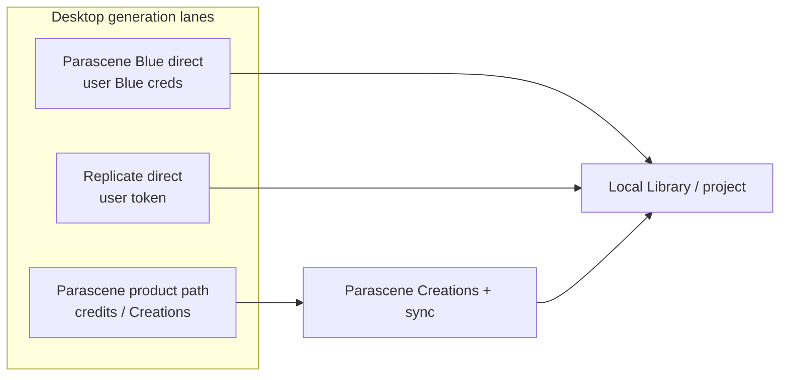
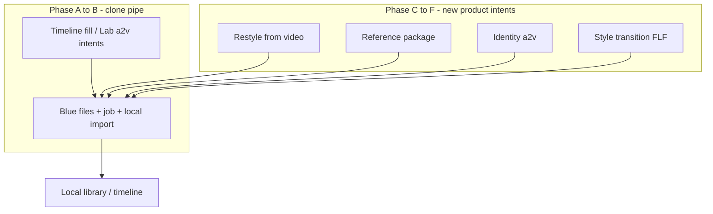

# Plan — Direct integration with Parascene Blue

Prove **Parascene Blue** as a first-class desktop generation lane: talk to `https://blue.parascene.com` with user credentials, upload inputs to Blue, run generation, and land outputs in the **local** library — without www create UI, Parascene-hosted intermediates, or Creation rows.

**Capabilities snapshot:** [parascene-blue-api-capabilities.json](./parascene-blue-api-capabilities.json).

This doc replaces the earlier placeholder. Implementation follows in later PRs; this pass is the plan only.

## Why (short)

- Desktop is where bleeding-edge Blue lands; web stays social / credits / softer.
- Blue already exposes `/api/files` uploads and advanced video (`video2video`, `reference2video`, newer models) that web does not fully surface — skip the middleman instead of pushing web forward.
- Keep Parascene product storage/DB from accumulating desktop scratch media.

## Lanes (do not conflate)



| Lane | UI label | Today | Target |
| --- | --- | --- | --- |
| Product | **Parascene** | OAuth → `sdk.create` `server_id: 6` → Creation → ingest | Stay credits-first; label must say Parascene, not Blue |
| Blue direct | **Parascene Blue** | Not wired (`.env` probe only) | Settings creds → Blue HTTP → local import |
| Replicate | **Replicate** | Settings token + local import | Peer pattern for Blue-direct gating |

Stable code ids (e.g. `parascene_blue` on the product path) may stay legacy until renamed; **user-facing copy** must not call the Creation path “Blue.”

## What we know (Blue server)

- **Base:** `https://blue.parascene.com`
- **Capabilities:** `GET /api` — status, methods, field schemas, capability matrix, retention TTLs
- **Methods (snapshot):** `text2image`, `image2image`, `text2video`, `image2video`, `audio2video`, `video2video`, `reference2video` — async, model/option fields
- **Inputs:** https URL, small data URI (images/audio; not video), or **`/api/files/…` upload refs** (Blue-native hosting; short TTL)
- **Auth observed (probe):** Bearer token; Cloudflare Access client id/secret headers; optional session cookies (`ps_session`, `cf_clearance`, `CF_Authorization`) that expire
- **Dev-only today:** repo-root `.env` keys (`PARASCENE_BLUE_*`) — **not** read by app code yet

Refresh the capabilities JSON when the server contract changes.

## Success criteria (“proved”)

A user can:

1. Save Blue credentials in **Settings**
2. Run **one** Blue-direct generation from desktop
3. Get a media file in the **local project library**
4. With **no** new Parascene Creation and **no** web UI work

## Proof phases

### 1. Naming / catalog

- Keep the product-path provider labeled **Parascene** (credits / Creations).
- Introduce a distinct **Parascene Blue** provider (or equivalent catalog entry) for direct-only methods.
- Badges / generate panel headers follow the same rule.
- Do not silently route “Blue” UI to `server_id: 6`.

### 2. Credentials (mirror Replicate)

Pattern reference: Replicate block in [`src/settings/SettingsModal.tsx`](../src/settings/SettingsModal.tsx) + keychain commands (`replicate_token_status` / `set` / `clear`).

**Ship in Settings:**

- Base URL (default `https://blue.parascene.com`)
- API token (Bearer)
- CF Access client id + secret
- Cookie field only if still required for early builds (document as optional / rotate when JWTs expire)

**Behavior:**

- Secure storage (prefer system keychain, same class as Replicate)
- Status / preview / replace / clear
- **Gate** all Parascene Blue–direct surfaces until configured (CTA to Settings) — same product idea as Replicate token gating
- Do not fall back to the Parascene product path when Blue creds are missing

`.env` remains useful for agents and capability probes; app runtime should prefer Settings-stored user creds.

### 3. Thin client

Minimum Blue HTTP surface for the proof:

| Step | Purpose |
| --- | --- |
| `GET /api` | Capabilities / health (optional warm check after save creds) |
| Upload to `/api/files` | Start-frame or other inputs without Parascene hosting |
| Submit async method | One generate endpoint per Blue’s contract |
| Poll / status | Job completion |
| Download output | Fetch result URL(s) |
| Local import | File into project library — **Replicate-style**, not `ingestRemoteCreation` |

**Ownership preference:** Rust-owned durable I/O and long-running wait ([PLAN-backend-ownership.md](./PLAN-backend-ownership.md)); React owns intent UI and status display.

**Provenance:** stamp local-only Blue-direct jobs clearly (provider = Parascene Blue direct), distinct from Creation-backed Parascene jobs and Replicate.

### 4. First proof surface

Prove the **pipe**, not the full method catalog.

**Preferred first method:** `image2video` with a start frame uploaded via Blue `/api/files` (or `text2video` if simpler for auth-only smoke). Use a model already familiar from the product path (e.g. `wan_i2v` / `ltx_i2v` or `wan_t2v` / `ltx_t2v`).

**Explicitly out of first proof:** productizing `video2video` / `reference2video` UI, MiniMax-full catalog, identity LoRA packages — those are **next** once the pipe is real.

Wire the proof into one existing desktop surface (e.g. Lab smoke or a gated Add Asset method) so it is reachable, not only a CLI.

### 5. Client growth required (proof)

| Area | Growth for proof | Later |
| --- | --- | --- |
| Provider catalog | Split Parascene vs Parascene Blue labels/lanes | Rename legacy ids if needed |
| Settings | Blue creds UI + storage + status events | Cookie rotation helpers |
| Blue HTTP client | Upload + create + poll + download | Full method field mapping from `GET /api` |
| Jobs / status | One job kind for Blue-direct | Parallelism, cancel, resume |
| Library | Local import path without Creation id | Optional promote-to-Creation |
| Generate UI | One gated method wired | Timeline fill parity, then new intents |

Desktop must grow here; web/parascene repo work is **not** required for the proof.

## Parity clone vs product growth

Two different jobs. **Do not conflate them.**

1. **Parity clone** — same desktop intents that already work on the Parascene product path; swap the pipe to Blue-direct.
2. **Product growth** — new desktop intents and substrate so makers can use what Blue already exposes (especially video-in and multi-ref) without waiting on web.



### What Blue-through-Parascene already supports

Today’s product path is mostly one composed workflow — **timeline fill** — plus Lab create / a2v / MV Build. Continuity + audio map onto three Blue methods via `sdk.create` `server_id: 6` → Creation → ingest.

| Product intent | Blue method | Models used today | Inputs staged via Parascene |
| --- | --- | --- | --- |
| Images: None | `text2video` | `wan_t2v`, `ltx_t2v` | prompt, duration, aspect |
| Start frame | `image2video` | `wan_i2v`, `ltx_i2v` | 1 still → Parascene upload URL |
| First + last | `image2video` | `wan_i2v` | 2 stills → Parascene URLs |
| Start + audio | `audio2video` | `ltx_a2v` | still URL + `audio_clip_id` |

**Key files (product path):** [`AddAssetGeneratePanel.tsx`](../src/layouts/editor/AddAssetGeneratePanel.tsx), [`addAssetGenerate.ts`](../src/layouts/editor/addAssetGenerate.ts), [`previewIntent.ts`](../src/layouts/editor/previewIntent.ts), runners under [`src/lab/`](../src/lab/) (`blueT2vGeneration.ts`, `flf2vGeneration.ts`, `ltxI2vGeneration.ts`, `a2vGeneration.ts`), [`ingestCreation.ts`](../src/lab/ingestCreation.ts).

**Not used on this path:** Blue `/api/files`, `prompt_magic`, MiniMax family, `ltx_style_transition`, `ltx_id_lora`, `video2video`, `reference2video`, Blue `text2image` / `image2image`.

Product mental model today: **blank clip → continuity + optional song audio → one video out.** That is what parity clone reuses.

### Phase A–B — Clone for Blue-direct (same product, new pipe)

Almost no UX redesign for those intents. Swap the middle:

```text
TODAY:  local still/audio → Parascene host → create(server 6) → Creation → ingest
DIRECT: local still/audio → Blue /api/files → Blue job → download → local import
```

| Reuse as-is | Must change |
| --- | --- |
| Add Asset form (prompt / WAN\|LTX / Images / Source audio / duration / framing) | Settings Blue creds + gate |
| Lab a2v / i2v shapes | Upload target → Blue `/api/files` |
| Timeline placeholder + resume UX | Submit / poll client (no Creation) |
| Badge field shape | Provider label **Parascene Blue**; Blue job id instead of Creation id |

- **A.** Creds + thin client + one cloned method → pipe proved (see Proof phases above).
- **B.** Clone the full timeline-fill matrix (and Lab a2v/i2v) onto Blue-direct → insider parity without Creations.

### Gap that parity does not close

| Blue has now | Desktop product today | What must grow |
| --- | --- | --- |
| `/api/files` for video / audio / image | Only Parascene hosting | Local → Blue upload as default for direct lane |
| Extra models on known methods (`minimax_*`, `ltx_style_transition`, `ltx_id_lora`, …) | Hardcoded WAN \| LTX toggles | Method-aware model picker (live `GET /api` or snapshot), not a 2-button enum |
| `prompt_magic`, longer windows, `start_offset_seconds` | Hidden / ignored | Expose where the method needs them |
| **`video2video`** | Nothing | New intent: driving / control video + optional character still |
| **`reference2video`** | Nothing | New intent: reference package (N images / videos / audios + tagged prompt) |
| Blue `text2image` / `image2image` | Lab stills via Replicate / server 1 | Optional Blue stills lane (product choice; Replicate may stay default for stills) |

Cloning timeline fill does **not** unlock v2v / r2v. Those need new **jobs the UI knows how to ask for**.

### Phase C–F — Modify the product for Blue’s new surface

Do **not** bolt every Blue field onto “Images: None | Start | First+last.” That ontology is still-continuity. Grow by **intent**, Blue-direct-first, mapped to Blue methods:

| New / extended intent | Blue method / models | Notes |
| --- | --- | --- |
| Restyle / control from video | `video2video` (`ltx_ic_lora`, `wan_animate`, `bernini_r_v2v`, `wan_scail*`) | Pick timeline clip or library video + optional ref still |
| Generate from references | `reference2video` (`minimax_r2v`, `ltx_ingredients`) | Reference tray; tagged prompt (`<Picture 1>`, …) |
| Identity talk | `audio2video` + `ltx_id_lora` | Extends a2v (start face required); does not replace `ltx_a2v` |
| Style morph | `image2video` + `ltx_style_transition` | First/last already half-there; unlock LTX + end frame |

**Shared substrate** (real product investment; unlocks C–F):

- **Media ref picker** — project stills, timeline clips, library videos / audio → Blue file refs
- **Source window** — in/out or `start_offset_seconds` + duration (needed for v2v)
- **Capabilities-aware form** — field schema from Blue (or checked-in snapshot), not a one-off WAN/LTX panel
- **Local-only provenance** — job id, method, model, input refs; no Creation id

Sequencing:

| Step | Outcome |
| --- | --- |
| **C.** Media ref picker + video upload to Blue | Unlocks everything below |
| **D.** One v2v model (e.g. `wan_animate` or `ltx_ic_lora`) | First “Blue can, web can’t” desktop feature |
| **E.** Reference package / MiniMax r2v | Multimodal maker workflow |
| **F.** Enrich existing methods (`prompt_magic`, MiniMax i2v/t2v, style transition, id-lora) | Depth on familiar surfaces |

### Explicitly do not

- Mirror web Advanced Create on desktop — web is behind Blue; desktop follows **Blue’s contract**, not www’s subset.
- Stuff v2v / r2v into timeline-fill continuity modes — wrong ontology.
- Wait for Parascene Creations / share hosting to grow `video_url_array` — that is the middleman Blue-direct skips.
- Ship full v2v / r2v as the first milestone — prove the pipe (A), then parity (B), then substrate (C).

## Open items

- Long-term auth: service token vs user session vs OAuth vs CF Access bag
- Whether/when local Blue gens can **promote** to Parascene Creations
- Credits UI coexistence (product lane) vs Blue-direct (no web credits)
- Retention: Blue input/output TTLs vs always archiving locally on success
- Refresh process for CF cookies if they remain in the auth story

## Out of scope (first implementation PR)

- Changing the web/parascene create UI for parity
- Shipping v2v / r2v / reference-package UI before phases A–B
- Replacing the Parascene credits product path (it stays for web migrants)

## Implementation checklist (when coding starts)

1. [ ] Settings: Blue creds set / status / clear + gate event (mirror Replicate)
2. [ ] Rust (preferred) thin Blue client: auth headers, files upload, job submit/poll, download
3. [ ] Catalog: Parascene vs Parascene Blue labeling; one Blue-direct method `wired: true` behind creds gate
4. [ ] Local import + provenance for Blue-direct output
5. [ ] Manual proof against live Blue; refresh capabilities snapshot if contract drifted
6. [ ] Phase B: clone full timeline-fill / Lab a2v matrix onto Blue-direct
7. [ ] Phases C–F: media ref picker, then v2v / r2v / enrichments (see above)
8. [ ] Doc status: mark proof complete; move open growth items to backlog as needed
