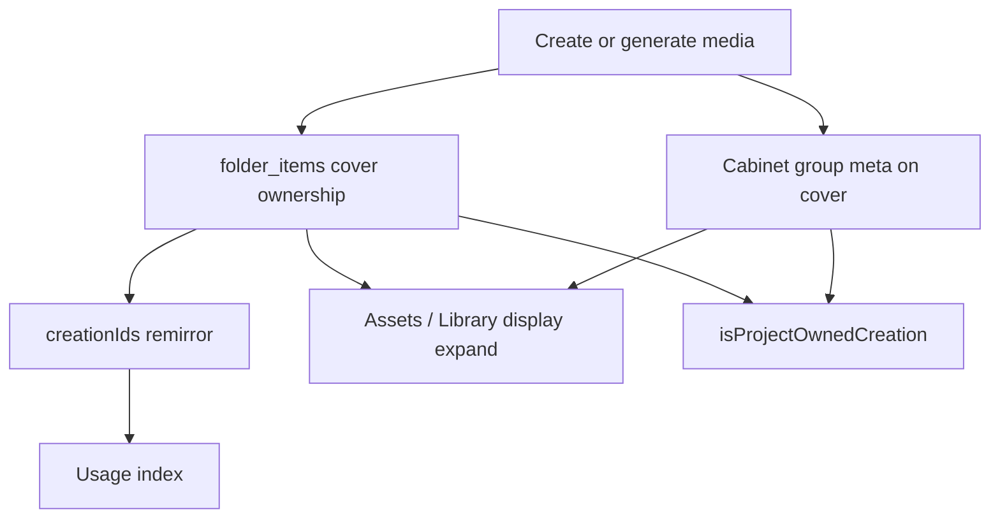

# Requirements — Project folders & cabinets

**Audience:** humans and coding agents working on Library folders, project ownership, Images/Videos cabinets, legacy open, Lab filing, or Assets display.

**Related:** [PLAN-project-owned-folders.md](./PLAN-project-owned-folders.md) (folder ownership cutover). This document is the **cabinet-era product model** and process catalog. Where the older plan’s “same inventory in Library and Assets” wording conflicts with cabinets, **this document wins for display**; ownership authority remains native `folder_items`.

---

## 1. Glossary

| Term | Meaning |
| --- | --- |
| **Project folder** | Library folder with `kind: "project"` and `project_id = P.id`. Exactly one per ready project. |
| **Regular folder** | Ordinary Library folder (`project_id` null). Not project ownership. |
| **Folder membership** | Native `folder_items`: which creations sit in which folder. **Authority for ownership.** |
| **`creationIds`** | Project JSON mirror of folder membership. One-way from native → JSON. Never wins over `folder_items`. |
| **Parascene group / cover** | Cloud+catalog group row (`meta.group.kind = "group_creations"`) with `source_creation_ids` / `source_creations`. |
| **Desktop cabinet** | Images or Videos group stamped for Desktop (`meta.desktop`, party name `Parascene Desktop · … · Images\|Videos`). Pointers: `imagesGroupId` / `videosGroupId`. |
| **Ordinary group** | Creative pack / non-cabinet group. Must not be expanded into project `creationIds`. |
| **Local-only creation** | Catalog row without (or not relying on) Parascene cloud identity; may sit in a project folder without cabinets. |
| **Legacy project** | Pre–folder-owned and/or no cabinets; may use `folderIds` / `boundFolderId` evidence and outside refs until reconciled. |
| **Owned asset** | Creation in P’s project folder (`folder_items`). |
| **Referenced creation** | ID used by timeline, slideshow, storyboard, composition, cabinet pointer, etc. May be outside the folder (legacy). |
| **Display-expanded member** | Cabinet member shown in Assets / under a group cover in UI **without** being filed as a loose folder tile for that reason. |
| **`provisioning` / `ready` / `repair-needed` / `legacy`** | Project lifecycle for folder setup. `legacy` = intentional unbound open (pre–folder-era docs only). |
| **`folderSetupIssue: "blocked"`** | Sticky chooser badge: open blocked on folder layout until fixed (or opened as legacy). |

---

## 2. Dimensions matrix

| Dimension | Library home | Library inside project folder | Editor Assets | Timeline / usage / delete protection | Native folder membership |
| --- | --- | --- | --- | --- | --- |
| **Cabinet covers** | Visible if unfiled; else inside project folder | Expected primary tiles | Cover tiles; members expanded under them | Cover is owned; members may be referenced | Cover IDs filed |
| **Cabinet members** | Hidden when grouped (open cover) | Hidden when cover is in same folder | Expanded for browse/select | May be referenced; **expand ≠ own** | Must **not** be filed solely for display |
| **Local-only** | Normal | Allowed extra folder tiles | Shown | Owned if filed | May be members without cabinets |
| **Legacy (no cabinets)** | Flat inventory | Flat inventory OK | Flat inventory | Outside refs possible | All owned assets in folder |
| **Compositions** | Badge / grouped presentation | Same ownership | May nest internals | Internals protected | Membership still real |

### Cabinet-era folder rule

```text
Parascene-backed project folder ≈ { Images cover, Videos cover }
                                 + optional local-only
                                 + optional non-cabinet owned assets only when product requires

Assets pane ≈ folder covers + display-expanded cabinet members
            (+ any non-cabinet owned assets)
```

---

## 3. Ownership vs display vs reference

1. **Ownership** = project folder membership (native). Remirror updates `creationIds`; JSON never overrides native.
2. **Display expansion** = UI-only (Library group open, Assets flatten). Never a reason to `addProjectAssets(allCabinetMembers)`.
3. **References** ≠ ownership. Legacy may keep outside refs (playable, delete-protected, visibly repair-needed). **Cabinet members** may be referenced without `folder_items` rows when their Images/Videos cover is filed in the project folder (`isProjectOwnedCreation`). New writers must not create arbitrary outside refs without ownership or that cabinet exception.
4. Opening a group or expanding Assets **does not** change `folder_items`.

---

## 4. Processes catalog

For each process: **When**, **Writes**, **Why**, **Risk**.

### 4.1 Create project

- **When:** New project from chooser (optional initial selection).
- **Writes:** Provisioning JSON → native project folder + `folder_items` for selection → remirror `creationIds`; clear legacy folder fields; `lifecycle: ready` (or `repair-needed` on failure); usage on persist.
- **Why:** One checked native transaction owns the folder before the project is ready.
- **Risk:** Treating pre-provision `creationIds` as owned. Selection is not owned until provision commits.

### 4.2 Open ready project

- **When:** Open with `lifecycle: ready` and no sticky folder block.
- **Writes:** Remirror `creationIds` from folder `memberIds`; clear `folderIds` / `boundFolderId`; usage rebuild. If cabinet pointers exist and members are still in `folder_items`, **collapse** them (unfile members; covers stay). Cabinets expand in UI only.
- **Why:** JSON must match native folder before Editor/Lab; heal polluted cover+member folders quietly.
- **Risk:** Assuming Assets inventory must equal folder tiles (cabinets expand without filing members).

### 4.3 Open legacy reconcile

- **When:** Open project that still needs a marked project folder (legacy bindings / unbound assets).
- **Writes:** Native claim/bind/create/block (`library_reconcile_legacy_project_folder`). On ready: remirror `creationIds` from claimed folder. May set `folderSetupIssue: "blocked"`.
- **Why:** Deterministic adoption — no silent multi-folder migration.
- **Risk:** Blocked ≠ empty project. Never drop timeline/composition refs. **Does not invent Images/Videos cabinets.** Legacy flat folder stays flat until Ensure (or user/Lab creates cabinets).

### 4.3b Open as intentional legacy

- **When:** User chooses **Open as legacy** on a *truly legacy* document (`lifecycle` unset or already `"legacy"`). Not available for `provisioning` / `repair-needed` / `ready` projects (those cannot be created as unbound anymore).
- **Writes:** Persist `lifecycle: "legacy"`; clear `folderSetupIssue`. **No** project folder create, claim, or asset move.
- **Why:** Escape hatch when folder layout cannot or should not be converted; reopen stays unbound.
- **Risk:** Outside refs and flat `creationIds` remain; no project-folder ownership. Do not offer this on new-project failures — those use Retry setup.

### 4.3c Delete project

- **When:** Chooser **Delete** (after confirm).
- **Writes:** Native `library_delete_project` first (convert marked folder to a regular folder with the same id/title/members; queue cloud meta clear; clear usage/membership rows; **keep** catalog media). Then remove the project document from localStorage (healthy or corrupt).
- **Why:** Projects can be retired without deleting Library files or exploding folder membership; never leave a marked folder without a document.
- **Risk:** Confirm is mandatory. Do not delete media as part of this action. Empty project list is allowed after the last delete.

Library delete of a creation is **item-scoped**: block only when that creation has usage rows or belongs to a project folder that cannot be audited on this device. Unrelated orphan/stale project folders must not lock the whole catalog.

### 4.4 Gather blocked

- **When:** User chooses “Move all into a new folder” on open-block dialog.
- **Writes:** New regular folder + `folder_items` for movable ids → reopen → reconcile claims it.
- **Why:** Put split root/unowned files in one place so reconcile can bind.
- **Risk:** Refuses foreign-project-owned ids. Gather ≠ “add to open project assets” API.

### 4.5 Ensure Images / Videos cabinets

- **When:** Lab → Project groups → Ensure (images / videos / both); jobs queue.
- **Writes:** Mint or recover cabinet covers + group meta; file **covers** into project folder; set `imagesGroupId` / `videosGroupId`; remirror `creationIds`; usage.
- **Why:** Guarantee desktop cabinets for Lab/Editor filing.
- **Risk:** Ensure must **not** mean “file every historical group member into the folder.” Resume attaches to the backend job — don’t start a second ensure and orphan covers.

### 4.6 Cleanup cabinets

- **When:** Lab → Delete / clean up groups.
- **Writes:** Remote + local teardown of covers/members; clear pointers; remove from project folder / `creationIds`.
- **Why:** Tear down Lab cabinets.
- **Risk:** Partial remote failure can still strip local project pointers — intended; verify remaining covers before re-Ensure.

### 4.7 Dedupe cabinets

- **When:** Lab → Dedupe cabinets.
- **Writes:** Ungroup orphan covers; append members into keeper; update pointers; keepers on folder; orphans removed from project.
- **Why:** One Images + one Videos cover per project.
- **Risk:** Wrong keeper preference merges the richer cabinet away.

### 4.8 `fileCreationIntoProjectGroup` (core filing)

- **When:** Lab create/mutate/a2v, MV Build, Editor add-asset generate — new media for a cabinet.
- **Writes:** Group API append (`[coverId, …newMemberIds]` only); stamp group meta; `addProjectAssets([cover])` only → `folder_items` + remirror; callers set group pointers. Members are **not** filed.
- **Why:** Member enters the cabinet; cover owns the folder tile; timeline may reference the member via cabinet ownership.
- **Risk:** Do not reintroduce filing members “so Assets can show them.” Do not dump **all** cabinet members into the folder.

### 4.9 Repair / collapse cabinets in folder

- **When:** Lab → Repair cabinets in folder; also on open for ready projects with cabinets (collapse only).
- **Writes:** Repair appends loose folder images/videos into cabinet group meta and ensures covers on folder; then **collapse** unfiles members that appear in cover `source_creation_ids` (covers + local-only remain). Remirror `creationIds`.
- **Why:** Members belong in group meta; folder stays cover-primary; timeline refs remain valid.
- **Risk:** Collapse must not delete media or drop timeline refs — only unfile from `folder_items`.

### 4.10 Lab create / MV Build filing

- **When:** Generation steps complete and file into Images/Videos.
- **Writes:** Same as §4.8 + pointer updates.
- **Why:** Outputs are project-owned and cabinet-organized.
- **Risk:** Skipping filing leaves Library rows outside project ownership checks.

### 4.11 Add-asset generate

- **When:** Editor Generate on timeline placeholders (may complete after Editor unmounts).
- **Writes:** Filing via §4.8; store merge of returned creation/group ids; timeline swap; usage.
- **Why:** Keep generations project-owned.
- **Risk:** Double-apply must stay idempotent. Must not rehydrate as “file every cabinet member.”

### 4.12 Editor cabinet display hydrate

- **When:** Editor open with `imagesGroupId` / `videosGroupId`.
- **Writes:** **Nothing** to folder / `creationIds` / group meta. Loads member ids for Assets/selection only (`cabinetDisplay.ts`).
- **Why:** Display flatten without ownership mutation.
- **Risk:** Mistaking hydrate for membership → incorrectly filing all members into the folder (regression we already hit).

### 4.13 Remove from cabinet (Editor)

- **When:** Assets “delete from group.”
- **Writes:** Ungroup / delete targets / regroup survivors; update folder/`creationIds`/pointers; may clear pointer if empty.
- **Why:** Edit cabinet membership without leaving a dead cover.
- **Risk:** Empty remaining set clears `imagesGroupId` / `videosGroupId`.

### 4.14 Add / remove project assets

- **When:** Explicit move into/out of project (Library or shell APIs).
- **Writes:** `library_add_project_assets` / `library_remove_project_assets` → `folder_items`; remirror; usage. Remove blocked if still used (unless path allows post-commit outside refs).
- **Why:** Explicit ownership changes.
- **Risk:** Cross-project move needs confirm. Remove of ordinary used assets stays blocked; unfiling **cabinet members** of an in-folder cover is allowed despite timeline usage (global delete still usage-protected).

### 4.15 Library sync reconcile

- **When:** After catalog/folder sync (`reconcileProjectsAfterLibrarySync`).
- **Writes:** For **ready** projects with a marked folder: `creationIds := folder.memberIds`; clear legacy folder fields; usage on save. Cover refresh / group-member manifest as needed.
- **Why:** JSON mirrors native after sync.
- **Risk:** Must **not** expand ordinary groups into `creationIds`. Skips unresolved legacy (open path only).

### 4.16 `library-folders-updated` mirror

- **When:** Native emits folder list after membership changes.
- **Writes:** Remirror every project’s `creationIds` from emitted folders; usage rebuild.
- **Why:** Keep React store aligned after any native folder mutation.
- **Risk:** Event only copies `memberIds` — never “expand groups.”

### 4.17 Folder cloud sync

- **When:** User/system syncs Library folders.
- **Writes:** Native ops / conflict apply → then remirror as §4.16.
- **Why:** Cloud↔local membership for project roots.
- **Risk:** Conflict resolution can move membership; mirror is one-way after native commit.

### 4.18 Import routing

- **When:** Project-scoped import (`importLocalPathsForProject` / native project import).
- **Writes:** New creations + project `folder_items` (FE does not pick folder id); remirror via folders-updated.
- **Why:** Imports land in the open project root.
- **Risk:** Plain `importLocalPaths` / arbitrary `folderId` is **not** project-routed — can leave assets unowned or in a non-project folder.

### 4.19 Composition promote / export

- **When:** User exports a composition result as a project asset; `showOutside` / promote flags in UI.
- **Writes:** Real ownership only via import/add to project folder. Workstream “show outside” is **UI-only**.
- **Why:** Composition internals stay internal until explicit export.
- **Risk:** Conflating UI promote with folder membership.

### 4.20 Usage index / mutation coordinator

- **When:** Startup init; every coordinated project/Library mutation.
- **Writes:** Stale barriers + `library_replace_project_usage` / repair from `collectProjectAssetUsage` (timeline, slideshow, storyboard, compositions, cabinets, …).
- **Why:** Protect deletes/moves against live refs.
- **Risk:** Saving with refs outside `creationIds` throws unless `allowLegacyOutsideTransition` or the creation is a **cabinet member** of an in-folder Images/Videos cover (`isProjectOwnedCreation` / `projectOwnership.ts`).

### 4.21 Chooser project-list heal

- **When:** Mount detects localStorage project ids missing from React state.
- **Writes:** Reloads list from storage (no folder mutation).
- **Why:** Recover after healthy-only publish / HMR drift (e.g. Melting Trip vanished from chooser).
- **Risk:** Not membership or cabinet repair.

### ID flow (summary)

```text
create/file → Parascene group meta (member ids on cover)
           → folder_items (cover only)
           → creationIds remirror from folder
           → usage index from project document refs
           → ownership includes cabinet members of in-folder covers
```



---

## 5. Legacy → folder-backed

| Step | What happens | What does **not** happen |
| --- | --- | --- |
| Open | Deterministic reconcile: adopt marked folder, single containing regular folder, all-root → new project folder, or **block** with per-folder id lists | Silent multi-folder merge; deleting media/timeline |
| On ready | `creationIds` = claimed folder `memberIds` | Inventing `imagesGroupId` / `videosGroupId` |
| Blocked | User fixes filing in Library (or Gather) and retries | Guessing ownership across foreign project folders |
| After ready | User/Lab may **Ensure** cabinets; covers filed into folder | Dumping every group member into `folder_items` “because Assets expands” |
| Outside refs | May remain from pre-cutover writers; protected + warned | New post-cutover writers creating more outside refs |

Legacy flat projects are valid forever without cabinets. Cabinets are additive organization for Parascene-backed workflows, not a requirement of folder ownership.

---

## 6. Code map

| Area | Location |
| --- | --- |
| Native folder membership / provision / reconcile | `src-tauri/src/library/project_assets.rs`, `folders.rs` |
| Ensure / cleanup jobs | `src-tauri/src/library/jobs.rs` |
| Desktop cabinet identity | `src/project/desktopProjectGroups.ts` |
| Ownership (folder + cabinet members) | `src/project/projectOwnership.ts` |
| Collapse cabinet members from folder | `src/project/cabinetFolderCollapse.ts` |
| Lab ensure / file / dedupe / repair | `src/lab/projectGroups.ts` |
| Display-only Assets helpers | `src/layouts/editor/cabinetDisplay.ts` |
| Library folder hide members under cover | `omitFolderMembersHiddenByCovers` in `src/library/creationFlags.ts` |
| Open / remirror / gather / collapse-on-open | `src/app/ShellProvider.tsx` |
| Sync remirror helpers | `src/project/reconcileProjectLibrary.ts` |
| Mutation / usage lock | `src/project/projectMutationCoordinator.ts` |
| Prior ownership plan | `docs/PLAN-project-owned-folders.md` |

---

## 7. Known conflicts / closed decisions

| Topic | Status |
| --- | --- |
| PLAN “Editor Assets and Library read the same inventory” vs cabinet display expansion | **Conflict noted** — display may show more than folder tiles; ownership stays folder (+ cabinet-member exception). PLAN “same inventory” is display-incomplete; ownership authority unchanged. |
| `fileCreationIntoProjectGroup` cover-only filing | **Closed** — files cover only; members live in group meta |
| Ensure/jobs `projectCreationIds` | **Closed** — covers only |
| Timeline refs to cabinet members **not** in `folder_items` | **Closed** — allowed when cover is in folder (`isProjectOwnedCreation`) |
| Unfiling already-expanded members from polluted folders | **Closed** — collapse on open + Lab repair |

---

## 8. Agent checklist

Before changing folder/cabinet code:

1. Are you filing cabinet **members** only so Assets can show them? **Stop** — use display expand.
2. Are you remirroring `creationIds` from anything other than folder `memberIds`? **Stop** — no ordinary-group expansion.
3. Is this legacy open? **Do not** invent cabinets or drop timeline refs to “clean” the folder.
4. Is the chooser missing a project? Check storage heal / corrupt isolation — **not** folder membership.
5. After filing media, did you update **group meta** and file the **cover** (not every member)? Timeline may reference members via cabinet ownership.
6. Read this doc + `PLAN-project-owned-folders.md` before “simplifying” ownership.
